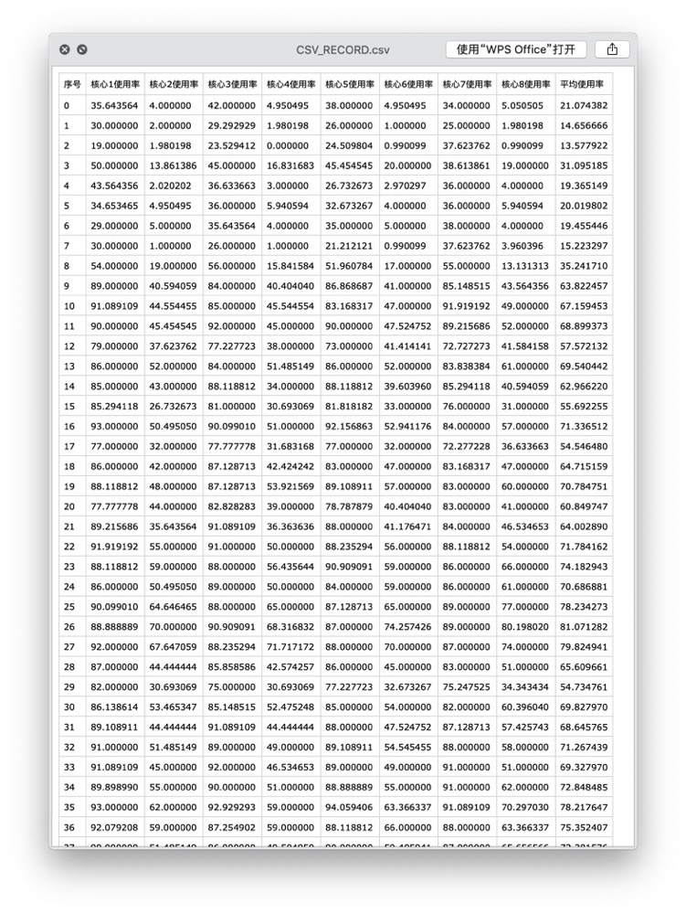
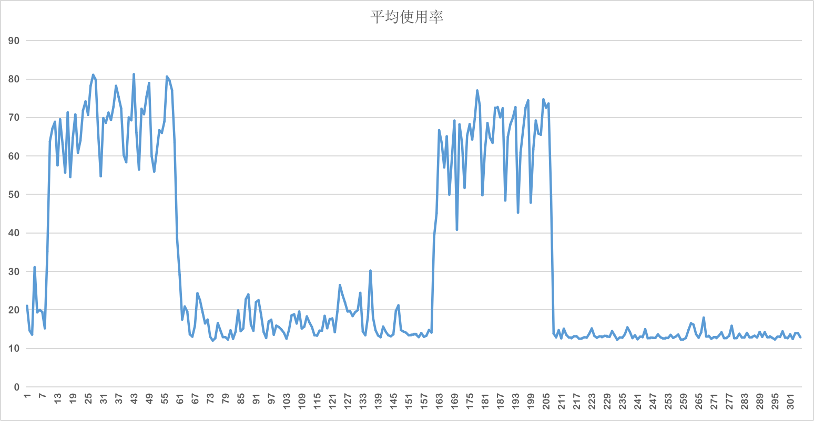

# 说明
本程序使用Go语言实现简单的电脑配置查询，用于记录电脑的CPU使用以及内存使用情况，同时支持汇总以及保存到CSV文件


## 代码依赖(gopm版本管理)

+ gopm get -g -v github.com/shirou/gopsutil/

> 如果需要打包Windows 版本需要另外安装如下依赖
+ gopm get -g -v github.com/StackExchange/wmi
+ gopm get -g -v github.com/go-ole/go-ole
+ gopm get -g -v github.com/go-ole/go-ole/oleutil

## 打包方式


+ MacOS 下打包

```shell script
$ CGO_ENABLED=0 GOOS=linux GOARCH=amd64 go build ./src/Main.go
$ CGO_ENABLED=0 GOOS=windows GOARCH=amd64 go build ./src/Main.go
```


+ Linux 平台

```shell script
$ CGO_ENABLED=0 GOOS=darwin GOARCH=amd64 go build ./src/Main.go
$ CGO_ENABLED=0 GOOS=windows GOARCH=amd64 go build ./src/Main.go
```

+ windows 平台

```shell script
$ SET CGO_ENABLED=0 SET GOOS=darwin3 SET GOARCH=amd64 go build ./src/Main.go
$ SET CGO_ENABLED=0 SET GOOS=linux SET GOARCH=amd64 go build ./src/Main.go
```


### 执行输出

```text
2019/11/09 21:35:41.586 [D]  启动检测线程完成
2019/11/09 21:35:41.586 [D]  正在启动目标程序信息
2019/11/09 21:35:41.587 [D]  第 0 次收集CPU数据，请稍后.....
2019/11/09 21:35:42.590 [D]  第 1 次收集CPU数据，请稍后.....
2019/11/09 21:35:43.595 [D]  第 2 次收集CPU数据，请稍后.....
2019/11/09 21:35:44.599 [D]  第 3 次收集CPU数据，请稍后.....
2019/11/09 21:35:45.603 [D]  第 4 次收集CPU数据，请稍后.....
2019/11/09 21:35:46.591 [D]  目标程序启动完成，正在收集数据，请稍等
2019/11/09 21:35:46.609 [D]  第 5 次收集CPU数据，请稍后.....
2019/11/09 21:35:47.614 [D]  第 6 次收集CPU数据，请稍后.....
2019/11/09 21:35:48.614 [D]  第 7 次收集CPU数据，请稍后.....
2019/11/09 21:35:49.619 [D]  第 8 次收集CPU数据，请稍后.....
2019/11/09 21:35:50.620 [D]  第 9 次收集CPU数据，请稍后.....
......
2019/11/09 21:40:43.514 [D]  第 301 次收集CPU数据，请稍后.....
2019/11/09 21:40:44.515 [D]  第 302 次收集CPU数据，请稍后.....
2019/11/09 21:40:45.519 [D]  第 303 次收集CPU数据，请稍后.....
2019/11/09 21:40:46.524 [D]  第 304 次收集CPU数据，请稍后.....
2019/11/09 21:40:46.595 [D]  目标程序执行完成.....
2019/11/09 21:40:47.528 [D]  程序执行完成.....
2019/11/09 21:40:47.528 [I]  ====================数据汇总完成====================
```


## 效果预览截图


### CSV预览图




> 根据个人电脑CPU的配置不同，其列数也不尽相同。

### 曲线图预览


> 个人笔记本电脑为8核处理器，所以有8个数据，Excel绘制的折线仅仅绘制了平均使用率，可根据个人喜好，使用WPS或者Excel打开CSV文件绘制变化图
